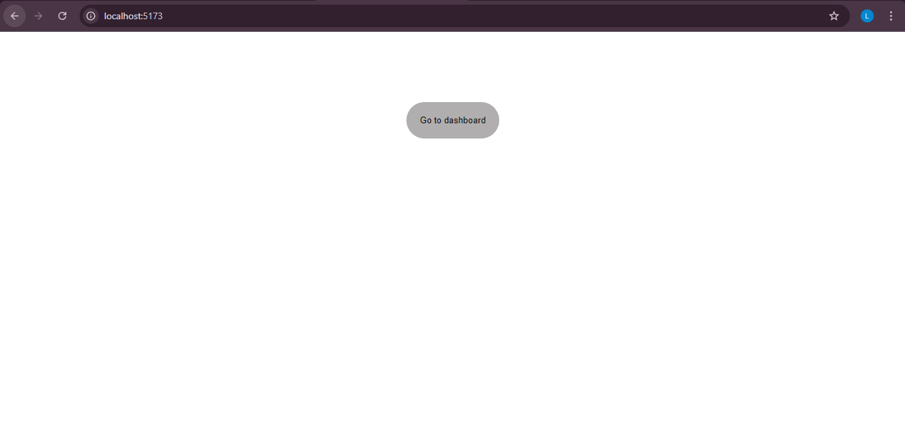
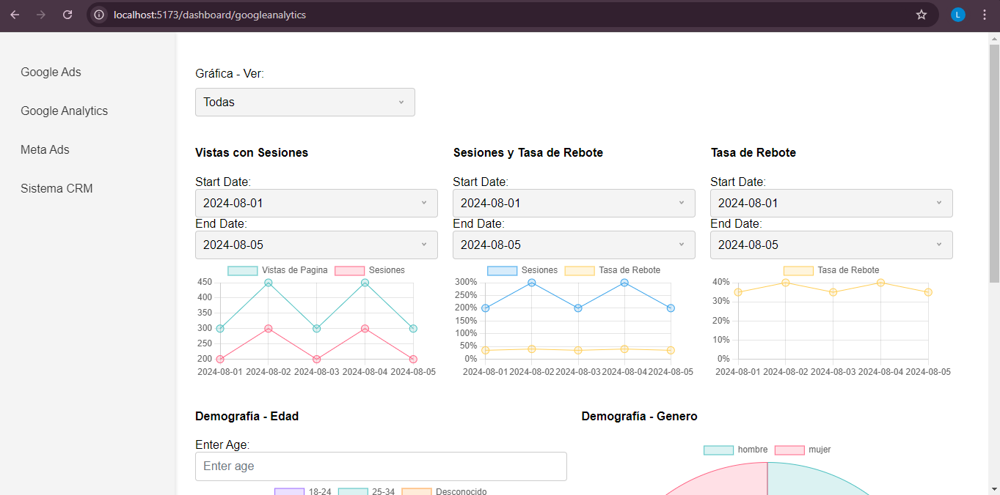
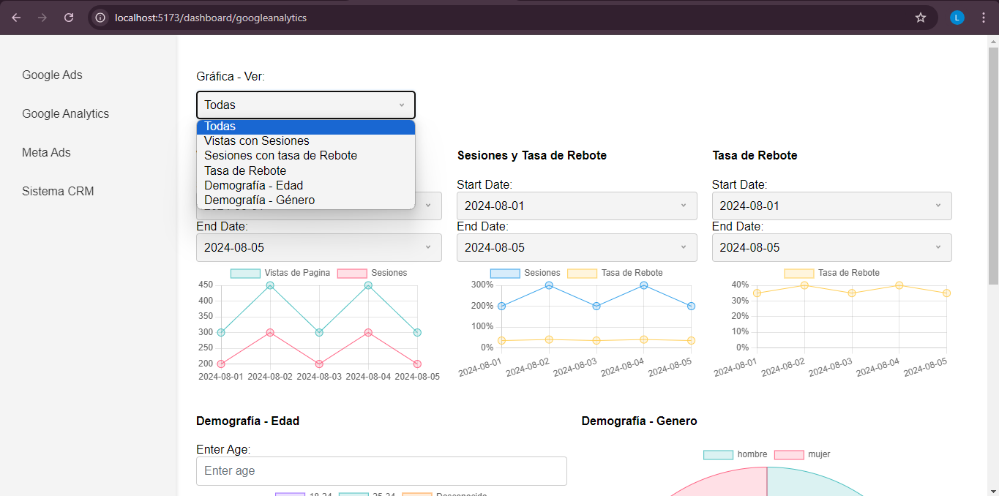
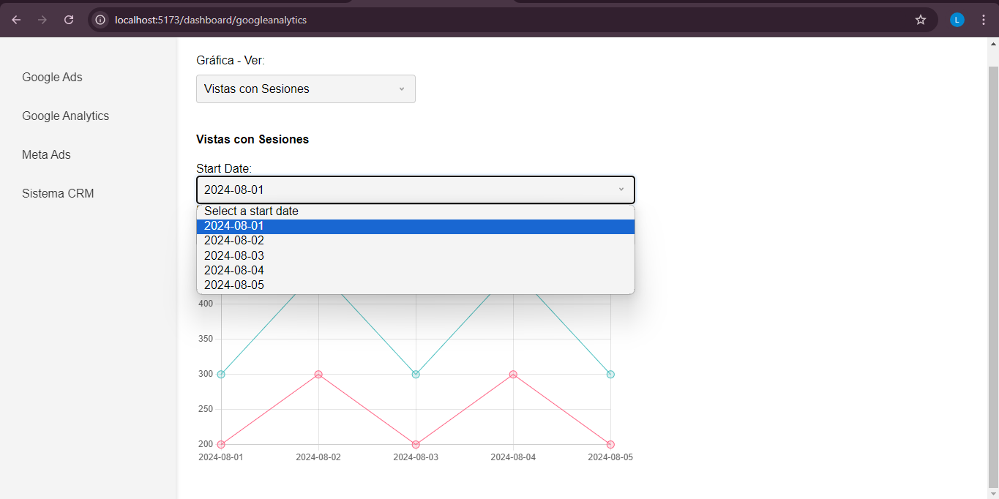
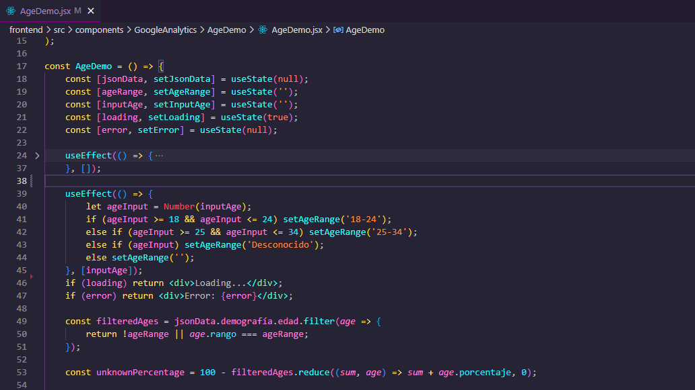

# Admira-Prueba

## Instrucciones para ver el código en entorno local 📖
- Clonar el repositorio.
- Dirigirse a la carpeta "frontend" -> `cd frontend`.
- Correr `npm install`.
- Correr `npm run dev`.
  *No hay variables de entorno.

Al iniciar el servidor, hacer click en el botón "Go to dashboard".

## Diseño
- Decidí implementar un diseño bastante básico, pero limpio y muy intuitivo.
- Me quedé con colores claros y simples porque creo que eso es lo que mejor se relaciona con un panel de administración.
- Para los colores de los gráficos, utilicé colores claros semi-transparentes para facilitar la vista. 
- Aquí se puede ver el sidebar de los diferentes JSON de pruebas que se quiera ver:
  
  

Se puede filtrar si se desea ver todas las gráficas del JSON al mismo tiempo o si se quiere ver una en específico:
  
  

En las gráficas de fechas, se puede seleccionar el rango de fechas. Las fechas son mapeadas del JSON:
  
  
  *Agregué más fechas al JSON e información "random" para este feature.

## Complejidades al momento de realizar la tarea
- Algo complejo que descubrí al momento de utilizar esta librería por primera vez fue un poco la sintaxis.
- Cómo mapear el JSON y ordenar la información del objeto que se usaría como props para el componente de las gráficas.
- Más específico fue cómo calcular el porcentaje por edad, así que así lo resolví:
  
  

Para el manejo de estados, cada llamada a la API se envolvía en un `try-catch` y los errores se guardaban en un `useState`. En caso de que hubiera un error, se renderiza el error.

## Conclusión
La verdad fue bastante interesante trabajar en este proyecto utilizando la librería de ChartJS, algo que nunca había hecho antes, y siento que ahora estoy mucho más cómodo ordenando la información para que se renderice como quiera en las gráficas. Lo más difícil hasta ahora fue pensar en cómo organizar el proyecto; al final decidí crear un archivo para cada gráfica en los JSON donde se usarían varias gráficas porque sería más fácil tanto para el usuario como para el desarrollador (yo) al momento de decidir qué hacer o qué información ver.

Espero que les guste el proyecto y agradecería mucho cualquier feedback que puedan tener. Estoy emocionado por la oportunidad y espero poder escuchar noticias positivas pronto.🙏
